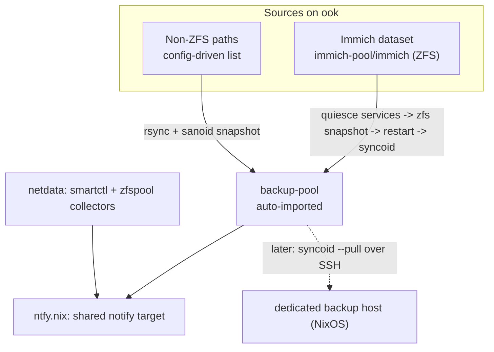

# ook backup & health monitoring strategy — design doc

Companion to `zfs-immich-mountpoint-incident.md`. Three separate modules now,
on purpose: backup, notification, and disk health are different concerns
with different failure modes and shouldn't share a blast radius.

## The three modules

**`ntfy.nix`** — just the notification target: `services.ntfyNotify.{url,topic,tokenFile}`,
the `ntfy-notify` script, and a generic `notify-failure@%n.service` template
any systemd unit can hook into via `onFailure`. Both other modules import
this so the topic is configured exactly once.

**`backup-suite.nix`** — replication only, no disk health. Two job lists
(`zfsReplication.jobs`, `nonZfsBackup.jobs`) so adding a source later is a
one-line diff.

**`netdata-monitoring.nix`** — SMART + zpool health via netdata's `smartctl`
and `zfspool` collectors, alerting routed through the same ntfy target via
netdata's `custom_sendmessage()` hook. This replaces the earlier
cron-script approach: netdata sees *trends* (reallocated-sector count
climbing over weeks, not just a point-in-time value) and gives you a
dashboard, not just alerts.

## Why quiesce-before-snapshot for Immich

Incident 1's root cause was a ZFS snapshot catching Postgres mid-write —
crash-consistent, not application-consistent, which led to WAL corruption
on restore. `quiesceServices` on a `zfsReplication` job fixes this at the
source instead of working around it — implemented via sanoid's own
`pre_snapshot_script` / `post_snapshot_script` hooks, not a custom wrapper:

1. sanoid's `pre_snapshot_script` stops `immich-server` +
   `immich-machine-learning` first — no more new writes into the dataset.
2. Then `postgresql` — clean checkpoint, no open WAL.
3. sanoid takes the snapshot itself, under its own naming (`autosnap_*`).
4. `post_snapshot_script` restarts everything, in reverse order (postgres
   first, so the app has a DB to connect to when it comes back). Runs even
   if the pre-script failed (`force_post_snapshot_script = yes`), so
   services never stay down because a stop command errored mid-sequence.
5. `syncoid --no-sync-snap` sends *that* snapshot — the flag matters,
   because without it syncoid creates its own sync snapshot at send time,
   which would silently defeat the whole point by snapshotting the live,
   already-restarted dataset instead.

Letting sanoid own the snapshot (rather than a separate custom script)
matters for a second reason too: sanoid only prunes snapshots that match
its own naming. An earlier draft of this took manually-named snapshots
(`backup-<timestamp>`) outside of sanoid, which sanoid correctly refused
to touch — they'd have piled up forever on the *production* pool. With
sanoid creating them, retention/pruning just works.

Total downtime is the stop → snapshot → start window, typically seconds —
the actual `zfs send` transfer happens afterward against the frozen
snapshot while services are already back up, since ZFS is copy-on-write
and new writes land in fresh blocks. Note `script_timeout` (default 5s in
sanoid, raised to 60s here via `quiesceScriptTimeout`) — a clean
`postgresql` stop under load can take longer than sanoid's own default.

Immich's own nightly `pg_dump` can stay as-is alongside this. It's now a
second, independent recovery path rather than the only trusted one — cheap
insurance, not a requirement.

`quiesceServices` is generic on the job type, not hardcoded to Immich, in
case you add other stateful services to `zfsReplication.jobs` later.

## Netdata: known gaps to verify after deploy

I don't have a netdata instance or a matching nixpkgs checkout in this
sandbox, so two things in `netdata-monitoring.nix` are best-effort and
flagged in the module's own comments:

- Whether NixOS's netdata module actually reads collector overrides from
  `/etc/netdata/go.d/*.conf` in your specific version — check
  `journalctl -u netdata` after first boot to confirm the collectors
  loaded rather than silently using stock config.
- Whether the classic `health_alarm_notify.conf` / `custom_sendmessage()`
  mechanism is still current, or whether your netdata version has moved
  fully to Netdata Cloud webhooks (which can also call ntfy, just via a
  different config surface).

Both `smartctl` and `zpool` need privileges the unprivileged `netdata` user
doesn't have by default — handled here via `use_sudo: yes` plus a narrow
sudoers rule scoped to those two read-only-in-spirit binaries, rather than
running netdata as root.

## Rollout checklist

1. Drop all three files into your flake's modules, import them into `ook`
   per `example-ook-usage.nix`.
2. Set `services.ntfyNotify.url` / `.topic` once — both other modules pick
   it up automatically.
3. `zfsReplication.jobs`: at minimum, the `immich` entry with
   `quiesceServices` as shown.
4. `nonZfsBackup.jobs`: whatever non-ZFS paths matter; add more over time.
5. `nixos-rebuild dry-build`, then `switch`. No Nix toolchain was available
   here to build-check this against your exact nixpkgs pin — treat the
   dry-build as the real check, especially for `netdata-monitoring.nix`'s
   unverified bits above.
6. Trigger manually once: `systemctl start backup-zfs-replicate.service`,
   watch the Immich services actually stop and restart cleanly, confirm
   the ntfy message arrives.
7. Deliberately break something once (stop the target dataset) to confirm
   `OnFailure` actually fires.
8. After netdata's been running a day or two, check its dashboard for the
   `smartctl`/`zfspool` charts to confirm data is flowing, then trigger a
   test alert if netdata supports it, to confirm the ntfy hook fires.

## Later: pulling to a dedicated backup host

Unchanged from before — not needed now, but this design doesn't fight it:
`backup-pool` already holds independently-snapshotted datasets under one
prefix, ready for a remote host to `syncoid --pull` over SSH (pull rather
than push, so a compromised `ook` can't wipe the off-box copies). Keep
`sanoid`'s retention generous enough that the remote pull interval always
has a common snapshot to increment from.
